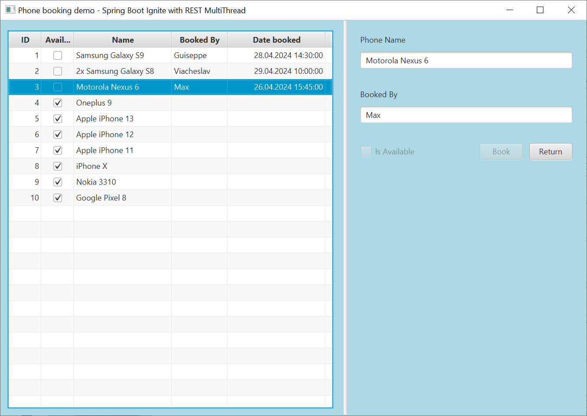

# Phone booking JavaFX REST app demo

The demo contains two projects  - a JavaFX client and a REST server. These projects were built using 
IntelliJ IDEA.

## ServerRest 
This is a REST Server, which is re-created using JPA, Hibernate, H2 in-memory database each time the server starts.

The project provides CRUD REST endpoints for the Phones table. Synchronous traditional REST server uses 
embedded Tomcat. See `applications.properties` file for custom configuration. You can access the database 
console at http://localhost:8080/h2-console, and its data is set from `data.sql` file. 

To start the server use `mvnw spring-boot:run` command. To stop - `mvnw spring-boot:stop`. 

## ClientFX 
A JavaFX & SpringBoot client that provides book/return operations.

It uses Gluon Ignite libraries. Adds JavaFX controller and FXML view. Spring Boot main application launches 
JavaFX. Both Ignite and Spring Boot contexts are initialized. Ignite supports popular DI frameworks and 
allows DI in JavaFX applications. JavaFX loader builds scene graph.

It uses WebFlux WebClient in blocking mode. It also uses JavaFX Concurrency library to make REST calls 
in a background thread. The code has a delay so you can see the progress indicator. You have to run the 
ServerRest project first.

To start the client use `mvn javafx:run`.

